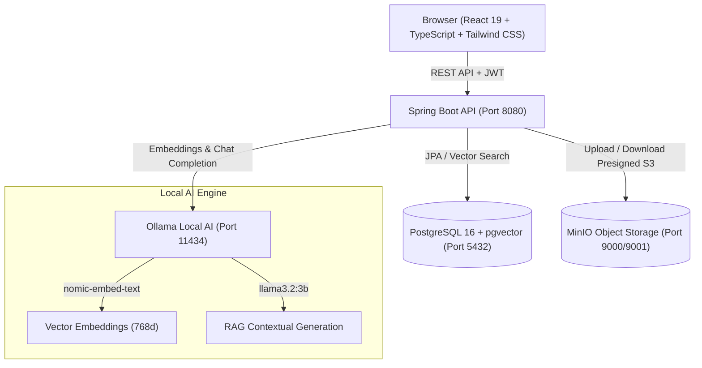
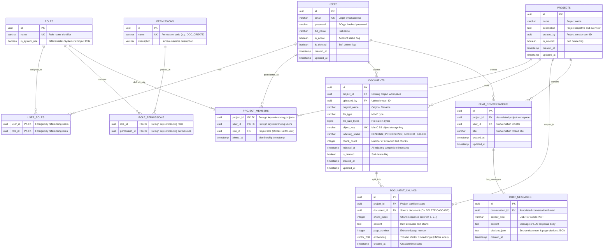

<div align="center">

# 📚 Enterprise Knowledge Base System
### Enterprise Knowledge Management & Local RAG AI Assistant

[](https://openjdk.org/)
[](https://spring.io/projects/spring-boot)
[](https://react.dev/)
[](https://www.typescriptlang.org/)
[-4169E1?style=for-the-badge&logo=postgresql&logoColor=white)](https://www.postgresql.org/)
[](https://min.io/)
[](https://ollama.com/)
[](http://localhost:8080/swagger-ui.html)
[](https://www.docker.com/)

<p align="center">
  A self-hosted enterprise document management platform featuring multi-tiered Role-Based Access Control (RBAC), S3-compatible cloud storage, and privacy-preserving local Retrieval-Augmented Generation (RAG) AI assistant operating entirely on-premise/offline.
</p>

</div>

---

## 🌟 Key Features

- 🔐 **Multi-Tiered Authentication & RBAC**:
  - Secure **JWT** authentication (15-minute Access Tokens with 7-day sliding Refresh Tokens).
  - Two-level authorization model: **System Level** (`ROLE_SYSTEM_ADMIN`, `ROLE_SYSTEM_USER`) and **Project Workspace Level** (`OWNER`, `MANAGER`, `EDITOR`, `VIEWER`).
  - Integrated **Quick User Switcher** on the frontend for instant role toggling during development and testing.

- 📁 **Project Workspace & Member Management**:
  - Strict project-scoped data isolation (Multi-tenancy).
  - Flexible member invitation and per-project role assignment.
  - Built-in **Soft Deletion** and automated **JPA Auditing** (`created_by`, `created_at`, `updated_at`).

- 📄 **Cloud Object Storage (MinIO S3) & Document Viewer**:
  - High-performance, secure file storage backed by **MinIO S3-compatible Object Storage**.
  - Secure uploads and downloads via time-limited **Presigned URLs**, preventing backend exposure.
  - Integrated **Document QuickLook**: In-browser preview for **PDF**, **Word (.docx)** (including structured tables), and **Markdown** without needing to download files locally.

- 🤖 **Local RAG (Retrieval-Augmented Generation) AI Engine**:
  - Automated document parsing & extraction (Apache PDFBox for PDF, Apache POI for DOCX with full table support).
  - Intelligent text chunking with configurable sliding window and token overlap.
  - High-dimensional vector embeddings generated using `nomic-embed-text` (768 dimensions), stored in PostgreSQL via the **pgvector** extension.
  - Real-time Cosine Similarity search powered by **HNSW indexing**, contextual prompt augmentation, and response generation via local LLMs (`llama3.2:3b` via **Ollama**) with precise **page-number and document source citations**.

- 📊 **Real-Time Administration Dashboard**:
  - Real-time operational metrics: Active users, projects, total document storage, and system activity logs.
  - Interactive data visualization powered by **Recharts**.
  - Global user management with instant account status toggles (Active / Suspended) and role elevation.

- 🎨 **Apple Glassmorphism UI/UX**:
  - Sleek, modern interface with frosted glass effects, curated HSL color palette, and fluid micro-animations.
  - Global keyboard shortcut **Spotlight Search** (`Cmd + K` or `Ctrl + K`) for instant navigation.

---

## 🏗️ System Architecture



---

## 🗄️ Database Schema (ERD)

The database schema is engineered on **PostgreSQL 16**, leveraging the **`pgvector`** extension to persist high-dimensional vector embeddings with an **HNSW** (`Hierarchical Navigable Small World`) cosine distance index:



### 📑 Functional Domain Breakdown

| Functional Domain | Primary Tables | Description |
| :--- | :--- | :--- |
| **1. Auth & RBAC** | `users`, `roles`, `permissions`, `user_roles`, `role_permissions` | Identity management, BCrypt password hashing, and two-tier authorization: System level (`ROLE_SYSTEM_ADMIN`, `ROLE_SYSTEM_USER`) and Project level (`OWNER`, `MANAGER`, `EDITOR`, `VIEWER`). |
| **2. Project Workspace** | `projects`, `project_members` | Multi-tenancy isolation. Members are assigned distinct roles per project workspace with support for Soft Deletion and JPA Auditing. |
| **3. Document Storage & Vector Store** | `documents`, `document_chunks` | Manages file metadata on MinIO S3 and stores text chunks alongside 768-dimensional embeddings generated by `nomic-embed-text`. Utilizes an **HNSW index** (`embedding vector_cosine_ops`) for fast Cosine Similarity queries. |
| **4. RAG AI Chat Engine** | `chat_conversations`, `chat_messages` | Maintains contextual conversation threads per project workspace. LLM responses (`llama3.2:3b`) are persisted alongside detailed source references (`citations_json`) for grounded verification. |

---

## 🛠️ Technology Stack

### Backend
- **Language**: Java 21 LTS
- **Framework**: Spring Boot 3.4+
- **Security**: Spring Security 6, JJWT (JSON Web Token 0.12.5)
- **Database**: PostgreSQL 16 with `pgvector`
- **Object Storage**: MinIO Java SDK 8.5
- **Document Processing**: Apache PDFBox 3.0, Apache POI 5.3
- **API Documentation**: SpringDoc OpenAPI 3.1, Swagger UI
- **Utilities**: MapStruct 1.6, Project Lombok

### Frontend
- **Core Libraries**: React 19, TypeScript
- **Bundler & Build Tool**: Vite 6+
- **Styling**: Tailwind CSS 4, CSS Glassmorphism
- **State Management**: Zustand
- **HTTP Client**: Axios (with Request & Response Interceptors for automatic Token Refresh)
- **Charts & UI**: Recharts, Lucide React, Docx-preview

### Infrastructure & AI
- **Containerization**: Docker & Docker Compose
- **Local LLM Engine**: Ollama (`llama3.2:3b` & `nomic-embed-text`)

---

## 🚀 Getting Started

### 1. Prerequisites
- [Java Development Kit (JDK) 21](https://adoptium.net/)
- [Node.js 18+](https://nodejs.org/) & `npm`
- [Docker Desktop](https://www.docker.com/products/docker-desktop/) (or Docker Engine & Docker Compose)
- [Ollama](https://ollama.com/) (Required for local AI RAG capabilities)

---

### 2. Start Database & Object Storage (Docker)

From the project root directory, launch PostgreSQL (pgvector) and MinIO:

```bash
docker compose up -d
```

Verify service availability:
- **PostgreSQL**: `localhost:5432` (User: `kb_user`, Password: `kb_password`, DB: `knowledge_base`)
- **MinIO API**: `localhost:9000`
- **MinIO Console (Web UI)**: [http://localhost:9001](http://localhost:9001) (User: `admin`, Password: `password123`)

---

### 3. Setup AI Models with Ollama (For Local RAG)

Pull the necessary models for vector embedding generation and contextual chat:

```bash
# Pull embedding model (required for semantic vector search)
ollama pull nomic-embed-text

# Pull LLM generation model
ollama pull llama3.2:3b
```

Ensure the Ollama service is active and listening on `http://localhost:11434`.

---

### 4. Run Backend Service (Spring Boot API)

Navigate to the `api` directory and run the application:

```bash
cd api
./mvnw spring-boot:run
```

- The backend automatically connects to PostgreSQL, activates the `pgvector` extension, creates tables, and seeds initial test data.
- API is accessible at: `http://localhost:8080`
- **Interactive Swagger UI**: [http://localhost:8080/swagger-ui.html](http://localhost:8080/swagger-ui.html)
- **OpenAPI 3.1 Spec JSON**: [http://localhost:8080/v3/api-docs](http://localhost:8080/v3/api-docs)

---

### 5. Run Frontend Application (React Web App)

Navigate to the `web` directory:

```bash
cd web
npm install
npm run dev
```

- The web application will launch at: [http://localhost:5173](http://localhost:5173)

---

## 👥 Pre-seeded Test Accounts

The database comes pre-populated with accounts configured across multiple permission levels:

| Role | Email | Password | Permission Scope |
|:---|:---|:---|:---|
| **System Admin** | `admin@knowledgebase.com` | `Admin12345` | Global system control, Analytics Dashboard, User & Project management |
| **Project Owner** | `owner@knowledgebase.com` | `Password123` | Full workspace control, member management, document upload and deletion |
| **Project Manager**| `manager@knowledgebase.com`| `Password123` | Document and member management within designated projects |
| **Project Editor** | `editor@knowledgebase.com` | `Password123` | Document upload, download, preview, and AI RAG interaction |
| **Project Viewer** | `viewer@knowledgebase.com` | `Password123` | Read-only document access, download, and AI chat querying |

> 💡 **Tip**: Use the **Quick User Switcher** at the bottom of the web app to switch between accounts with a single click—no manual typing required!

---

## 📂 Project Directory Structure

```
Project/
├── api/                            # Spring Boot Backend Service
│   ├── src/main/java/com/knowledgebase/api/
│   │   ├── config/                 # MinIO, Security, and DataInitializer configs
│   │   ├── controller/             # REST Endpoints (Auth, Project, Doc, Chat, Admin)
│   │   ├── domain/                 # JPA Entities & Enums (User, Role, Document, etc.)
│   │   ├── dto/                    # Request/Response Data Transfer Objects
│   │   ├── exception/              # Global Exception Handler & Standardized Errors
│   │   ├── mapper/                 # MapStruct Entity-DTO Mappers
│   │   ├── repository/             # Spring Data JPA Repositories (Vector Search)
│   │   ├── security/               # JWT Filter, Token Provider, UserDetails
│   │   └── service/                # Business Logic, RAG Engine & MinIO Storage
│   └── src/main/resources/
│       └── application.yml         # Application configuration
├── web/                            # React + Vite Frontend
│   ├── src/
│   │   ├── api/                    # Axios API clients and interceptors
│   │   ├── components/             # SpotlightSearch, QuickLook, AIChatDrawer, etc.
│   │   ├── pages/                  # Dashboard, Login, Register, ProjectDetail, Admin
│   │   ├── store/                  # Zustand Global State Stores
│   │   └── types/                  # TypeScript Interfaces & Types
├── doc/                            # Technical Documentation & Specifications
│   ├── SRS.md                      # Software Requirements Specification
│   ├── Architecture_Standards.md   # Architectural & API Guidelines
│   ├── Roadmap.md                  # Development Roadmap
│   └── phases/                     # Detailed Phase 1 - 6 Milestone Specs
├── init-scripts/                   # PostgreSQL Initialization Scripts (pgvector setup)
│   └── 01-init.sql
├── docker-compose.yml              # Container definitions (PostgreSQL + MinIO)
└── README.md                       # Main Project Documentation
```

---

## 📡 Core REST APIs

| Method | Endpoint | Description | Required Authorization |
|:---|:---|:---|:---|
| `POST` | `/api/v1/auth/login` | User authentication (returns JWT & Refresh Token) | Public |
| `POST` | `/api/v1/auth/register`| Register a new user account | Public |
| `POST` | `/api/v1/auth/refresh` | Refresh expired access token | Public |
| `GET`  | `/api/v1/projects` | List projects accessible to current user | Authenticated |
| `POST` | `/api/v1/projects` | Create a new project workspace | Authenticated |
| `GET`  | `/api/v1/projects/{id}/documents` | Retrieve all documents within a project | Project Member |
| `POST` | `/api/v1/projects/{id}/documents/upload` | Upload document to MinIO and trigger indexing | Editor / Owner |
| `GET`  | `/api/v1/documents/{id}/preview` | Generate secure Presigned URL for preview | Project Member |
| `POST` | `/api/v1/chat/ask` | Contextual RAG query against project documents | Project Member |
| `GET`  | `/api/v1/admin/stats` | Retrieve real-time Admin Dashboard statistics | System Admin |
| `GET`  | `/api/v1/admin/users` | Retrieve and manage global user directory | System Admin |

---

## 📜 License

This project is developed for educational, research, and enterprise software evaluation purposes.  
Authored by **Tran Quoc Bao** ([@tqbao4205](https://github.com/tqbao4205)).
