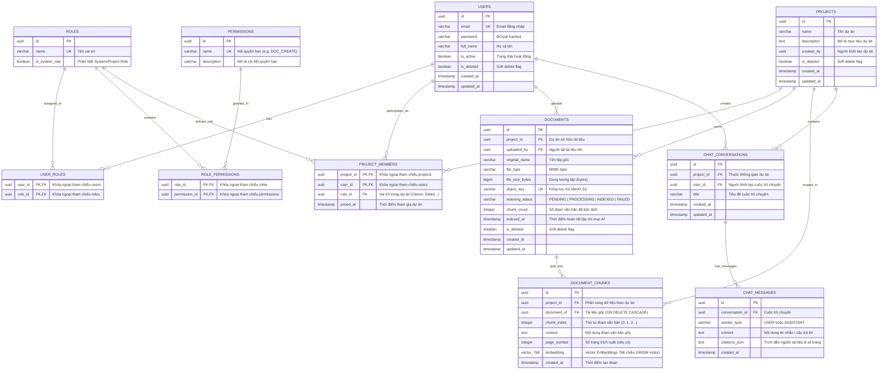

<div align="center">

# 📚 Knowledge Base System
### Hệ Thống Quản Lý Tri Thức Doanh Nghiệp & Trợ Lý RAG AI Cục Bộ

[](https://openjdk.org/)
[](https://spring.io/projects/spring-boot)
[](https://react.dev/)
[](https://www.typescriptlang.org/)
[-4169E1?style=for-the-badge&logo=postgresql&logoColor=white)](https://www.postgresql.org/)
[](https://min.io/)
[](https://ollama.com/)
[](https://www.docker.com/)

<p align="center">
  Nền tảng quản trị tài liệu, phân quyền dự án theo vai trò (RBAC) và tích hợp trợ lý AI hỏi đáp ngữ cảnh chuyên sâu (RAG) vận hành hoàn toàn offline/local đảm bảo bảo mật dữ liệu.
</p>

</div>

---

## 🌟 Tính Năng Nổi Bật

- 🔐 **Xác Thực & Phân Quyền Đa Cấp (RBAC)**:
  - Hệ thống xác thực bằng **JWT** (Access Token 15 phút, Refresh Token 7 ngày với cơ chế xoay vòng tự động).
  - Phân quyền 2 tầng: **Hệ thống** (`ROLE_SYSTEM_ADMIN`, `ROLE_SYSTEM_USER`) và **Dự án** (`OWNER`, `MANAGER`, `EDITOR`, `VIEWER`).
  - Đi kèm công cụ **Quick User Switcher** giúp chuyển đổi nhanh giữa các tài khoản mẫu để kiểm thử phân quyền tiện lợi.

- 📁 **Quản Lý Dự Án & Thành Viên**:
  - Không gian làm việc cô lập theo từng dự án (Project-scoped isolation).
  - Mời thành viên tham gia dự án, phân quyền linh hoạt theo từng thành viên.
  - Hỗ trợ **Soft Delete** (xóa mềm) và **JPA Auditing** (tự động theo dõi người tạo/sửa).

- 📄 **Quản Lý & Lưu Trữ Tài Liệu Đám Mây (MinIO S3)**:
  - Tải lên, phân loại và lưu trữ tệp an toàn trên **MinIO Object Storage** (tương thích AWS S3).
  - Sử dụng **Presigned URL** tải/xem file bảo mật, không lộ storage backend.
  - Tích hợp tính năng **Document QuickLook**: Xem trước trực tiếp tệp **PDF**, **Word (.docx)**, và **Markdown** ngay trên trình duyệt mà không cần tải về máy.

- 🤖 **Trợ Lý AI RAG (Retrieval-Augmented Generation)**:
  - Tự động trích xuất nội dung văn bản (Apache PDFBox cho PDF, Apache POI cho Word DOCX).
  - Phân đoạn văn bản thông minh (Text Chunking) với chiến lược Sliding Window & Overlap.
  - Sinh Vector Embeddings bằng model `nomic-embed-text` và lưu trữ trong PostgreSQL với extension **pgvector**.
  - Tìm kiếm tương đồng vector (Cosine Similarity Search) và trả lời bằng LLM cục bộ (`llama3.2:3b` qua **Ollama**) kèm **trích dẫn số trang/nguồn tài liệu (Citations)** chính xác.

- 📊 **Bảng Điều Khiển Quản Trị (Admin Dashboard)**:
  - Thống kê thời gian thực: Tổng người dùng, tổng dự án, dung lượng lưu trữ, hoạt động hệ thống.
  - Biểu đồ trực quan hóa dữ liệu sử dụng **Recharts**.
  - Quản lý trạng thái tài khoản (Khóa/Mở khóa), phân quyền Admin.

- 🎨 **Giao Diện Chuẩn Apple Glassmorphism**:
  - Thiết kế hiện đại với hiệu ứng kính mờ (Glassmorphism), bảng màu HSL cao cấp và chuyển động vi mô (micro-animations) mượt mà.
  - Hỗ trợ phím tắt tìm kiếm nhanh **Spotlight Search** (`Cmd + K` hoặc `Ctrl + K`).

---

## 🏗️ Kiến Trúc Hệ Thống


---

## 🗄️ Sơ Đồ Cơ Sở Dữ Liệu (Database Schema / ERD)

Toàn bộ hệ thống cơ sở dữ liệu được thiết kế theo chuẩn quan hệ (Relational Database) trên **PostgreSQL 16**, kết hợp cùng extension **`pgvector`** để lưu trữ và truy vấn vector tương đồng cao chiều với thuật toán chỉ mục **HNSW** (`Hierarchical Navigable Small World`):



### 📑 Chi Tiết 4 Nhóm Bảng Chức Năng

| Phân hệ | Các bảng chính | Mô tả chức năng |
| :--- | :--- | :--- |
| **1. Xác thực & Phân quyền (Auth & RBAC)** | `users`, `roles`, `permissions`, `user_roles`, `role_permissions` | Quản lý định danh người dùng, mã hóa mật khẩu, phân quyền 2 tầng linh hoạt: Hệ thống (`ROLE_SYSTEM_ADMIN`, `ROLE_SYSTEM_USER`) và Dự án (`OWNER`, `MANAGER`, `EDITOR`, `VIEWER`). |
| **2. Không gian Dự án (Workspace & Project)** | `projects`, `project_members` | Đảm bảo tính cô lập dữ liệu (Multi-tenancy isolation). Thành viên được gán vai trò theo từng dự án độc lập, hỗ trợ Soft-delete và JPA Auditing. |
| **3. Lưu trữ & Vector AI (Documents & pgvector)** | `documents`, `document_chunks` | Quản lý siêu dữ liệu file trên MinIO S3 và lưu trữ các phân đoạn văn bản kèm vector nhúng 768 chiều sinh bởi model `nomic-embed-text`. Sử dụng chỉ mục **HNSW** (`embedding vector_cosine_ops`) để tăng tốc độ truy vấn độ tương đồng Cosine Similarity. |
| **4. Trợ lý AI & Lịch sử hội thoại (RAG Chat Engine)** | `chat_conversations`, `chat_messages` | Lưu trữ phiên hội thoại theo ngữ cảnh từng dự án. Các câu trả lời của LLM (`llama3.2:3b`) được lưu kèm thông tin trích dẫn nguồn tài liệu (`citations_json`) phục vụ xác thực độ tin cậy. |

---

## 🛠️ Công Nghệ Sử Dụng

### Backend
- **Ngôn ngữ**: Java 21 LTS
- **Framework**: Spring Boot 3.4+
- **Bảo mật**: Spring Security 6, JJWT (JSON Web Token 0.12.5)
- **Cơ sở dữ liệu**: PostgreSQL 16 kết hợp `pgvector`
- **Object Storage**: MinIO Java SDK 8.5
- **Trích xuất dữ liệu**: Apache PDFBox 3.0, Apache POI 5.3
- **Tiện ích**: MapStruct 1.6, Project Lombok

### Frontend
- **Thư viện chính**: React 19, TypeScript
- **Bundler & Build Tool**: Vite 6+
- **Styling**: Tailwind CSS 4, CSS Glassmorphism
- **Quản lý trạng thái**: Zustand
- **HTTP Client**: Axios (với Request & Response Interceptors xử lý Refresh Token)
- **Biểu đồ & UI**: Recharts, Lucide React, Docx-preview

### Cơ sở hạ tầng & AI
- **Container**: Docker & Docker Compose
- **Local LLM Engine**: Ollama (`llama3.2:3b` & `nomic-embed-text`)

---

## 🚀 Hướng Dẫn Cài Đặt & Chạy Dự Án

### 1. Yêu cầu hệ thống (Prerequisites)
- [Java Development Kit (JDK) 21](https://adoptium.net/)
- [Node.js 18+](https://nodejs.org/) & `npm`
- [Docker Desktop](https://www.docker.com/products/docker-desktop/) (hoặc Docker Engine & Docker Compose)
- [Ollama](https://ollama.com/) (Dành cho tính năng AI RAG)

---

### 2. Khởi động Cơ sở dữ liệu & Storage (Docker)

Tại thư mục gốc của dự án, khởi chạy PostgreSQL (pgvector) và MinIO:

```bash
docker compose up -d
```

Kiểm tra trạng thái container:
- **PostgreSQL**: `localhost:5432` (User: `kb_user`, Password: `kb_password`, DB: `knowledge_base`)
- **MinIO API**: `localhost:9000`
- **MinIO Console (Web UI)**: [http://localhost:9001](http://localhost:9001) (User: `admin`, Password: `password123`)

---

### 3. Cài đặt mô hình AI trên Ollama (Tùy chọn cho RAG)

Nếu muốn sử dụng tính năng Chatbot AI tra cứu tài liệu:

```bash
# Tải mô hình sinh vector embedding (bắt buộc cho tìm kiếm ngữ nghĩa)
ollama pull nomic-embed-text

# Tải mô hình sinh câu trả lời
ollama pull llama3.2:3b
```

Đảm bảo dịch vụ Ollama đang chạy tại `http://localhost:11434`.

---

### 4. Khởi chạy Backend (Spring Boot API)

Chuyển vào thư mục `api` và chạy ứng dụng:

```bash
cd api
./mvnw spring-boot:run
```

- Backend sẽ tự động kết nối PostgreSQL, khởi tạo bảng, kích hoạt extension `pgvector` và tự động nạp dữ liệu mẫu (Data Seeding).
- API hoạt động tại: `http://localhost:8080`

---

### 5. Khởi chạy Frontend (React Web App)

Chuyển vào thư mục `web`:

```bash
cd web
npm install
npm run dev
```

- Ứng dụng Web sẽ khởi chạy tại: [http://localhost:5173](http://localhost:5173)

---

## 👥 Tài Khoản Mẫu Để Kiểm Thử (Seed Accounts)

Hệ thống đã chuẩn bị sẵn các tài khoản với đầy đủ các quyền hạn khác nhau:

| Vai trò | Email | Mật khẩu | Phạm vi quyền |
|:---|:---|:---|:---|
| **System Admin** | `admin@knowledgebase.com` | `Admin12345` | Toàn quyền quản trị hệ thống, Dashboard thống kê, Quản lý User/Project |
| **Project Owner** | `owner@knowledgebase.com` | `Password123` | Quản lý dự án mẫu, thêm/xóa thành viên, tải và xóa tài liệu |
| **Project Manager**| `manager@knowledgebase.com`| `Password123` | Quản lý tài liệu và thành viên trong dự án |
| **Project Editor** | `editor@knowledgebase.com` | `Password123` | Tải lên, tải về, xem tài liệu, sử dụng AI RAG |
| **Project Viewer** | `viewer@knowledgebase.com` | `Password123` | Chỉ có quyền xem và tải về tài liệu, dùng AI hỏi đáp |

> 💡 **Mẹo**: Ở góc dưới màn hình giao diện web có thanh **Quick User Switcher**, bạn chỉ cần 1 click để đăng nhập ngay vào bất kỳ tài khoản nào mà không cần nhập tay email/mật khẩu!

---

## 📂 Cấu Trúc Thư Mục

```
Project/
├── api/                            # Spring Boot Backend Service
│   ├── src/main/java/com/knowledgebase/api/
│   │   ├── config/                 # Cấu hình MinIO, Security, DataInitializer
│   │   ├── controller/             # REST Endpoints (Auth, Project, Doc, Chat, Admin)
│   │   ├── domain/                 # JPA Entities, Enums (User, Role, Document, etc.)
│   │   ├── dto/                    # Request/Response DTOs
│   │   ├── exception/              # Global Exception Handler & Error Codes
│   │   ├── mapper/                 # MapStruct Mappers
│   │   ├── repository/             # Spring Data Repositories (Vector Search)
│   │   ├── security/               # JWT Filter, Token Provider, UserDetails
│   │   └── service/                # Business Logic, RAG Chat & MinIO Service
│   └── src/main/resources/
│       └── application.yml         # Cấu hình ứng dụng
├── web/                            # React + Vite Frontend
│   ├── src/
│   │   ├── api/                    # Axios clients & endpoints
│   │   ├── components/             # SpotlightSearch, QuickLook, AIChatDrawer, v.v.
│   │   ├── pages/                  # Dashboard, Login, Register, ProjectDetail, Admin
│   │   ├── store/                  # Zustand Auth Store
│   │   └── types/                  # TypeScript Types
├── doc/                            # Tài liệu đặc tả kỹ thuật dự án
│   ├── SRS.md                      # Đặc tả yêu cầu phần mềm
│   ├── Architecture_Standards.md   # Tiêu chuẩn kiến trúc & API chuẩn hóa
│   ├── Roadmap.md                  # Lộ trình phát triển
│   └── phases/                     # Tài liệu chi tiết từng Phase 1 - 6
├── docker-compose.yml              # Cấu hình PostgreSQL (pgvector) & MinIO
└── README.md                       # Tài liệu hướng dẫn chính
```

---

## 📡 Tổng Quan API Chính (Core REST APIs)

| Phương thức | Endpoint | Mô tả | Quyền yêu cầu |
|:---|:---|:---|:---|
| `POST` | `/api/v1/auth/login` | Đăng nhập hệ thống (trả JWT & Refresh Token) | Public |
| `POST` | `/api/v1/auth/register`| Đăng ký tài khoản người dùng mới | Public |
| `POST` | `/api/v1/auth/refresh` | Làm mới access token | Public |
| `GET`  | `/api/v1/projects` | Lấy danh sách dự án của người dùng | Authenticated |
| `POST` | `/api/v1/projects` | Tạo dự án mới | Authenticated |
| `GET`  | `/api/v1/projects/{id}/documents` | Lấy danh sách tài liệu trong dự án | Project Member |
| `POST` | `/api/v1/projects/{id}/documents/upload` | Tải lên tài liệu lên MinIO & lập chỉ mục | Editor / Owner |
| `GET`  | `/api/v1/documents/{id}/preview` | Lấy Presigned URL xem trước file | Project Member |
| `POST` | `/api/v1/chat/ask` | Hỏi đáp AI RAG theo ngữ cảnh tài liệu | Project Member |
| `GET`  | `/api/v1/admin/stats` | Lấy số liệu thống kê Dashboard | System Admin |
| `GET`  | `/api/v1/admin/users` | Quản lý danh sách người dùng toàn hệ thống | System Admin |

---

## 📜 Giấy Phép (License)

Dự án được phát triển phục vụ mục đích học tập, nghiên cứu và phát triển phần mềm doanh nghiệp.
Phát triển bởi **Tran Quoc Bao** ([@tqbao4205](https://github.com/tqbao4205)).
