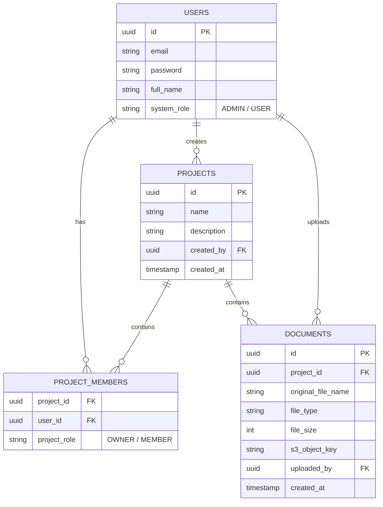

# Software Requirements Specification (SRS)
## Project Knowledge Base System

### 1. Giới thiệu (Introduction)
#### 1.1 Mục đích (Purpose)
Tài liệu này đặc tả các yêu cầu phần mềm cho dự án "Project Knowledge Base System" (Hệ thống Quản lý Tri thức Dự án). Tài liệu phục vụ làm cơ sở cho quá trình phát triển, kiểm thử và nghiệm thu dự án.

#### 1.2 Phạm vi (Scope)
Hệ thống là một ứng dụng Web cho phép các nhóm lưu trữ, quản lý và chia sẻ tài liệu theo từng Project. 
Giai đoạn 1 sẽ tập trung vào các tính năng cốt lõi (Auth, Project, File). Giai đoạn 2 (Tương lai) sẽ tích hợp AI Chatbot để hỏi đáp về tài liệu.

### 2. Mô tả Tổng quan (Overall Description)
#### 2.1 Các vai trò người dùng (User Roles)
*   **Admin**: Quản trị viên hệ thống. Có toàn quyền quản lý User và Project trên toàn hệ thống.
*   **Owner**: Người tạo ra Project. Có quyền quản lý Project của mình (sửa tên, xóa) và mời/xóa thành viên.
*   **Member (User)**: Thành viên được mời vào Project. Có quyền xem, tải lên, tải xuống tài liệu trong Project đó.

#### 2.2 Môi trường vận hành (Operating Environment)
*   **Client**: Trình duyệt web hiện đại (Chrome, Safari, Edge).
*   **Backend**: Java Spring Boot 3, Java 21, Maven.
*   **Database**: PostgreSQL 16.
*   **Storage**: MinIO (S3 Compatible Object Storage).

### 3. Yêu cầu Chức năng (Functional Requirements)

#### 3.1 Module Xác thực (Authentication)
*   **FR-AUTH-01**: Hệ thống cho phép người dùng đăng ký tài khoản mới bằng Email, Mật khẩu, Tên hiển thị.
*   **FR-AUTH-02**: Hệ thống cho phép đăng nhập bằng Email/Mật khẩu.
*   **FR-AUTH-03**: Hệ thống sử dụng JWT Token để duy trì phiên đăng nhập.

#### 3.2 Module Quản lý Dự án (Project Management)
*   **FR-PROJ-01**: User (đã login) có thể tạo Project mới và tự động trở thành Owner của Project đó.
*   **FR-PROJ-02**: Owner có thể xem, sửa, xóa Project của mình.
*   **FR-PROJ-03**: Owner có thể thêm thành viên vào Project bằng cách nhập Email (User được thêm phải có tài khoản trên hệ thống).
*   **FR-PROJ-04**: Owner có thể xóa thành viên khỏi Project.
*   **FR-PROJ-05**: User có thể xem danh sách các Project mà mình tham gia (dưới vai trò Owner hoặc Member).
*   **FR-PROJ-06**: Bảo mật dữ liệu: User không thuộc Project sẽ không thể xem hay tìm thấy thông tin/tài liệu của Project đó.

#### 3.3 Module Quản lý Tài liệu (Document Management)
*   **FR-DOC-01**: Thành viên trong Project có thể tải lên (upload) các loại file (Văn bản, Hình ảnh, Video) vào Project.
*   **FR-DOC-02**: Hệ thống giới hạn định dạng file được phép tải lên.
*   **FR-DOC-03**: Thành viên có thể xem danh sách file trong Project (Tên file, Ngày tải, Kích thước, Người tải).
*   **FR-DOC-04**: Thành viên có thể tải xuống (download) file.
*   **FR-DOC-05**: Người trực tiếp tải file lên HOẶC Owner của Project có quyền xóa file đó.

### 4. Yêu cầu Phi chức năng (Non-Functional Requirements)
*   **Bảo mật (Security)**: Mật khẩu phải được mã hóa (BCrypt) trước khi lưu. File vật lý lưu trên MinIO không được Public, ứng dụng sẽ sinh ra các đường dẫn tạm thời (presigned-url) để trình duyệt có thể tải/xem file an toàn.
*   **Hiệu năng (Performance)**: Các API tra cứu dữ liệu phải phản hồi dưới 500ms.
*   **Mở rộng (Scalability)**: Hệ thống được thiết kế linh hoạt. Có thể thay thế MinIO bằng AWS S3 dễ dàng bằng cách đổi cấu hình biến môi trường.

### 5. Mô hình Dữ liệu (Entity Relationship Diagram)

### 6. Các quyết định đã chốt (Decisions Made)
Vì bạn đã phê duyệt, hệ thống sẽ sử dụng các thiết lập mặc định sau cho Giai đoạn 1:
1. **Quản lý file**: Danh sách phẳng (Flat list), không có cấu trúc thư mục con để giữ UI đơn giản.
2. **Kích thước File Tối đa**: Giới hạn ở 100MB cho mỗi file tải lên.
3. **Quên mật khẩu**: Chưa phát triển trong Giai đoạn 1. User quên mật khẩu cần báo Admin reset.
