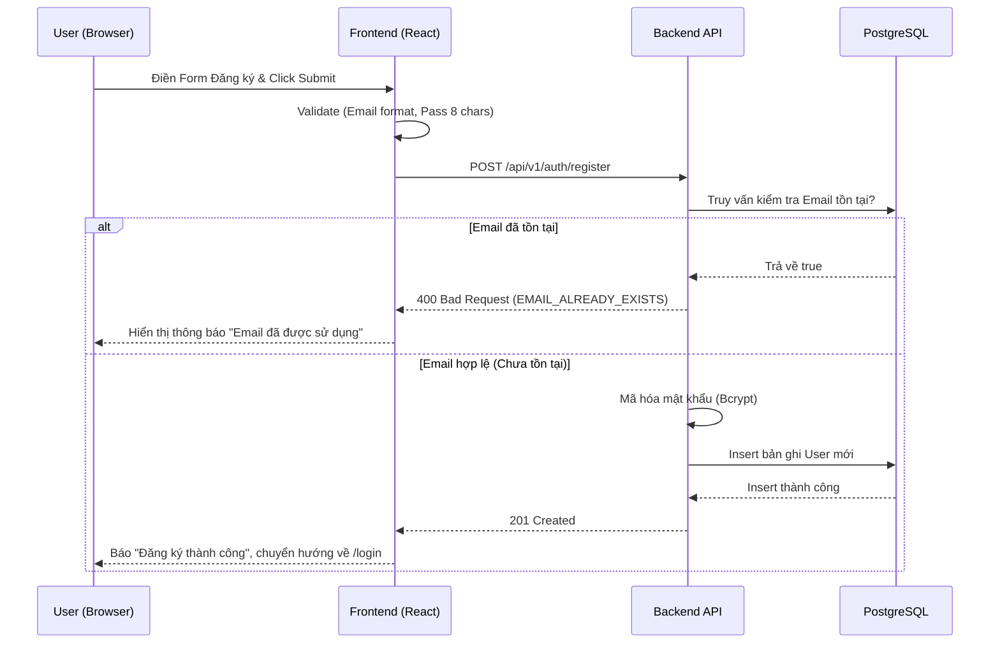
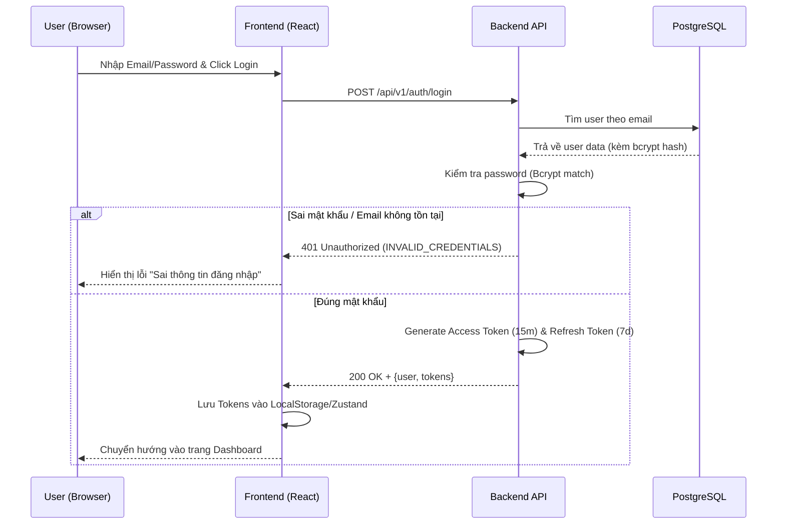
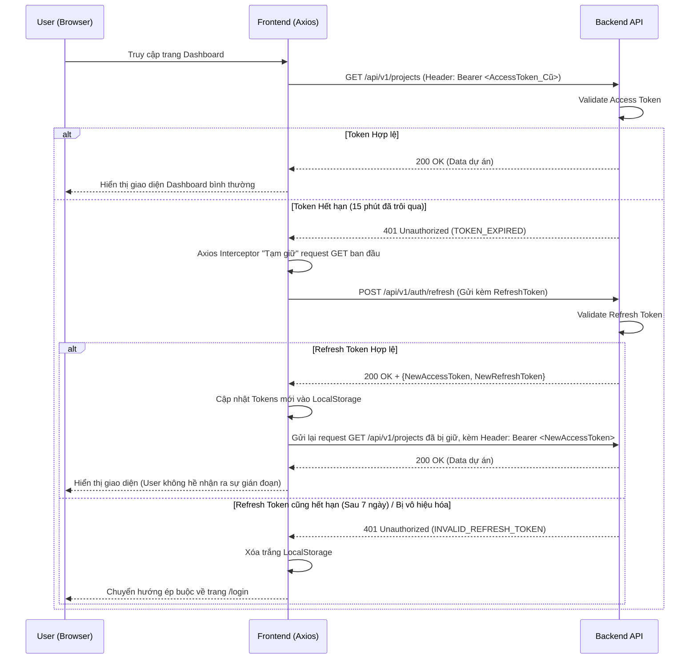

# Detailed Specification - Phase 1: Identity & Security (Auth)

## 1. Tổng quan & Quy tắc nghiệp vụ (Business Rules)
Module Authentication chịu trách nhiệm định danh và cấp quyền truy cập cho người dùng thông qua JWT (JSON Web Token).
- **Mật khẩu (Password)**: Yêu cầu tối thiểu 8 ký tự, phải có ít nhất 1 chữ cái và 1 chữ số. Mật khẩu lưu trong DB bắt buộc phải mã hóa một chiều bằng thuật toán `BCrypt`.
- **Email**: Phải đúng định dạng chuẩn, không phân biệt hoa thường (tự động chuyển về lowercase trước khi lưu), và là duy nhất (Unique) trên toàn hệ thống.
- **Tokens**: Sử dụng cơ chế 2 tokens:
  - `Access Token`: Dùng để gọi API. Thời gian sống (TTL): **15 phút**.
  - `Refresh Token`: Dùng để xin cấp lại Access Token mới khi token cũ hết hạn. Thời gian sống (TTL): **7 ngày**.

## 2. Thiết kế Cơ sở dữ liệu (Database Schema)

Bảng **`users`**:
- `id` (UUID, Primary Key)
- `email` (Varchar, Unique, Not Null)
- `password` (Varchar, Bcrypt, Not Null)
- `full_name` (Varchar)
- `created_at`, `updated_at`, `is_deleted`

Bảng **`roles`**:
- `id` (UUID, Primary Key)
- `name` (Varchar, Unique) (VD: ROLE_SYSTEM_ADMIN)
- `is_system_role` (Boolean) (Phân biệt role cục bộ project hay role toàn hệ thống)

Bảng **`permissions`**:
- `id` (UUID, Primary Key)
- `name` (Varchar, Unique) (VD: PROJECT_CREATE, USER_MANAGE)
- `description` (Varchar)

Bảng **`role_permissions`**:
- `role_id` (UUID, FK)
- `permission_id` (UUID, FK)
- Primary Key (`role_id`, `permission_id`)

Bảng **`user_roles`**:
- `user_id` (UUID, FK)
- `role_id` (UUID, FK)
- Primary Key (`user_id`, `role_id`)

## 3. Đặc tả API (API Contracts)

### 3.1. Đăng ký tài khoản (Register)
- **Method & Path**: `POST /api/v1/auth/register`
- **Security**: Public
- **Request Body**:
```json
{
  "email": "bao@example.com",
  "password": "Password123",
  "fullName": "Tran Quoc Bao"
}
```
- **Validation**:
  - `email`: NotBlank, Email format.
  - `password`: NotBlank, Size(min=8), Pattern(chữ và số).
  - `fullName`: NotBlank.
- **Response - Success (201 Created)**:
```json
{
  "success": true,
  "message": "Đăng ký tài khoản thành công",
  "data": null
}
```
- **Response - Error (400 Bad Request)**: Lỗi `EMAIL_ALREADY_EXISTS` nếu email đã tồn tại.

### 3.2. Đăng nhập (Login)
- **Method & Path**: `POST /api/v1/auth/login`
- **Security**: Public
- **Request Body**:
```json
{
  "email": "bao@example.com",
  "password": "Password123"
}
```
- **Response - Success (200 OK)**:
```json
{
  "success": true,
  "message": "Đăng nhập thành công",
  "data": {
    "user": {
      "id": "123e4567-e89b-12d3-a456-426614174000",
      "email": "bao@example.com",
      "fullName": "Tran Quoc Bao",
      "systemRoles": ["ROLE_SYSTEM_USER"],
      "permissions": ["PROJECT_CREATE", "PROJECT_READ"]
    },
    "tokens": {
      "accessToken": "eyJhbGciOiJIUz...",
      "refreshToken": "def456..."
    }
  }
}
```
- **Response - Error (401 Unauthorized)**: Lỗi `INVALID_CREDENTIALS` nếu sai email hoặc mật khẩu.

### 3.3. Cấp lại Token (Refresh Token)
- **Method & Path**: `POST /api/v1/auth/refresh`
- **Security**: Public
- **Request Body**:
```json
{
  "refreshToken": "def456..."
}
```
- **Response - Success (200 OK)**:
```json
{
  "success": true,
  "message": "Refresh token thành công",
  "data": {
    "accessToken": "eyJhbGciOiJIUz_NEW...",
    "refreshToken": "def456_NEW..." 
  }
}
```
- **Response - Error (401 Unauthorized)**: Lỗi `REFRESH_TOKEN_EXPIRED` hoặc `INVALID_REFRESH_TOKEN`.

## 4. Chi tiết Frontend (React)

### 4.1. Giao diện (UI Components)
- **Login Page (`/login`)**:
  - Form: Input Email, Input Password (có icon ẩn/hiện), Nút "Đăng nhập", Nút "Đăng ký ngay" (chuyển trang).
  - Validation: Kiểm tra rỗng trước khi submit.
  - Xử lý lỗi: Hiển thị lỗi màu đỏ dưới input nếu sai thông tin.
- **Register Page (`/register`)**:
  - Form: Input Full Name, Input Email, Input Password, Nút "Đăng ký".
  - Chuyển hướng: Đăng ký xong báo Toast success và tự động chuyển về trang Login.

### 4.2. State Management & Axios
- Sử dụng **Zustand** hoặc **Context API** để tạo `AuthStore` lưu trữ thông tin User (id, email, fullName, role).
- `accessToken` và `refreshToken` được lưu trong **LocalStorage**.
- **Axios Interceptor**:
  - Request: Tự động nhét `Authorization: Bearer <accessToken>` vào header.
  - Response: Nếu server trả về `401 TOKEN_EXPIRED`, interceptor tự động hold request đó lại, gọi API `/auth/refresh` để lấy token mới, sau đó gắn token mới vào request bị hold và gọi lại (User không hề hay biết). Nếu refresh cũng bị lỗi 401, tự động log out và đẩy về `/login`.

## 5. Sequence Diagram (Sơ đồ Luồng hoạt động)

### 5.1. Luồng Đăng ký (Register)


### 5.2. Luồng Đăng nhập (Login)


### 5.3. Luồng Cấp lại Token (Auto Refresh Token)
Luồng này chạy ngầm thông qua Axios Interceptor, giúp user không bị văng ra ngoài mỗi 15 phút.


