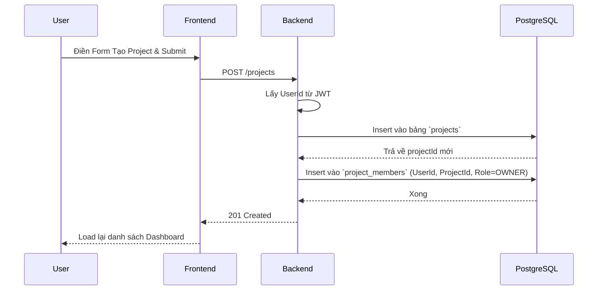
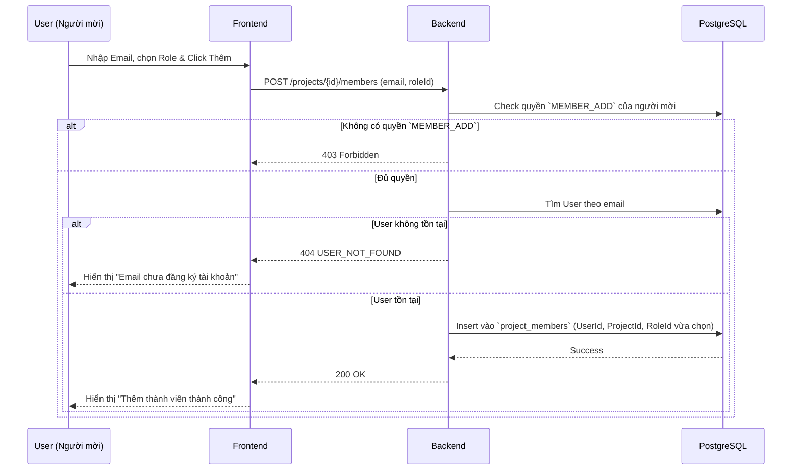

# Detailed Specification - Phase 2: Project Management

## 1. Tổng quan & Quy tắc nghiệp vụ (Business Rules)
Module này quản lý vòng đời của một Dự án và các thành viên trong đó.
- **Cô lập dữ liệu (Multi-tenancy cấp Project)**: Bất kỳ API nào có `projectId` trên URL đều phải qua màng lọc kiểm tra quyền: "User hiện tại có nằm trong bảng `project_members` của Project này không?". Nếu không -> 403 Forbidden.
- **Quyền hạn (RBAC)**:
  - Chỉ người có role chứa permission `PROJECT_CREATE` (mặc định ai cũng có) mới được tạo project.
  - Người tạo Project tự động được thêm vào `project_members` với `role_id` là `ROLE_PROJECT_OWNER`.
  - Chỉ `OWNER` mới có quyền `PROJECT_UPDATE` (đổi tên), `PROJECT_DELETE` (xóa), và `MEMBER_MANAGE` (mời/đuổi thành viên).
- **Mời thành viên**: Mời bằng Email. Nếu Email chưa đăng ký tài khoản trên hệ thống -> Báo lỗi. Nếu đã có -> Thêm vào `project_members` với role mặc định là `ROLE_PROJECT_MEMBER`.

## 2. Thiết kế Cơ sở dữ liệu (Database Schema)

Bảng **`projects`**
| Column Name | Data Type | Constraints | Description |
| :--- | :--- | :--- | :--- |
| `id` | UUID | Primary Key | |
| `name` | VARCHAR(255) | NOT NULL | Tên dự án |
| `description` | TEXT | | Mô tả chi tiết |
| `created_by` | UUID | FK -> users | Người tạo (JPA Auditing) |
| `created_at` | TIMESTAMP | NOT NULL | (JPA Auditing) |
| `updated_at` | TIMESTAMP | NOT NULL | (JPA Auditing) |
| `is_deleted` | BOOLEAN | DEFAULT FALSE | Xóa mềm |

Bảng **`project_members`**
| Column Name | Data Type | Constraints | Description |
| :--- | :--- | :--- | :--- |
| `project_id` | UUID | PK, FK -> projects | |
| `user_id` | UUID | PK, FK -> users | |
| `role_id` | UUID | FK -> roles | Quyền trong dự án |
| `joined_at` | TIMESTAMP | NOT NULL | Ngày tham gia |

## 3. Dữ liệu mẫu RBAC (Seed Data)
Khi khởi chạy ứng dụng, hệ thống sẽ tự động nạp các Permissions và Roles mặc định sau cho cấp độ Project:

### 3.1. Danh sách Permissions (Quyền)
- `PROJECT_UPDATE`: Đổi tên, mô tả dự án.
- `PROJECT_DELETE`: Xóa dự án.
- `MEMBER_ADD`: Mời thành viên mới.
- `MEMBER_REMOVE`: Xóa thành viên.
- `MEMBER_CHANGE_ROLE`: Thay đổi quyền của thành viên khác.
- `DOCUMENT_READ`: Xem/Tải xuống tài liệu.
- `DOCUMENT_UPLOAD`: Tải lên tài liệu.
- `DOCUMENT_DELETE_ANY`: Xóa tài liệu của bất kỳ ai (Quyền tối thượng, còn mặc định ai tải file lên thì người đó được phép tự xóa file của mình).

### 3.2. Danh sách Roles (Chức vụ)
- **ROLE_PROJECT_OWNER**: Chứa TẤT CẢ 8 permissions trên.
- **ROLE_PROJECT_MANAGER**: Chứa tất cả trừ `PROJECT_DELETE`.
- **ROLE_PROJECT_EDITOR**: Chứa `DOCUMENT_READ` và `DOCUMENT_UPLOAD`.
- **ROLE_PROJECT_VIEWER**: Chỉ chứa `DOCUMENT_READ`.

## 4. Đặc tả API (API Contracts)

Yêu cầu chung: Tất cả API phải có header `Authorization: Bearer <accessToken>`.

### 3.1. Tạo Dự án mới (Create Project)
- **Method & Path**: `POST /api/v1/projects`
- **Request Body**:
```json
{
  "name": "Dự án Alpha",
  "description": "Tài liệu thiết kế hệ thống"
}
```
- **Validation**: `name` (NotBlank, max 255).
- **Response (201 Created)**:
```json
{
  "success": true,
  "message": "Tạo dự án thành công",
  "data": {
    "id": "abc...",
    "name": "Dự án Alpha",
    "createdAt": "..."
  }
}
```

### 3.2. Lấy danh sách Dự án của tôi
- **Method & Path**: `GET /api/v1/projects`
- **Query Params**: `page` (default 0), `size` (default 10)
- **Logic**: Chỉ Join và lấy các project mà `user_id` của tôi tồn tại trong `project_members` và `is_deleted = false`.
- **Response (200 OK)**:
```json
{
  "success": true,
  "data": [
    {
      "id": "abc...",
      "name": "Dự án Alpha",
      "myRole": "ROLE_PROJECT_OWNER", 
      "memberCount": 5
    }
  ],
  "meta": { "page": 0, "size": 10, "totalElements": 1 }
}
```

### 3.3. Lấy Chi tiết & Danh sách thành viên Dự án
- **Method & Path**: `GET /api/v1/projects/{projectId}/members`
- **Security Check**: User hiện tại có trong project này không?
- **Response (200 OK)**:
```json
{
  "success": true,
  "data": {
    "project": { "id": "...", "name": "..." },
    "members": [
      { "userId": "...", "email": "a@a.com", "fullName": "Nguyễn A", "role": "ROLE_PROJECT_OWNER" },
      { "userId": "...", "email": "b@b.com", "fullName": "Trần B", "role": "ROLE_PROJECT_MEMBER" }
    ]
  }
}
```

### 3.4. Thêm thành viên vào Dự án
- **Method & Path**: `POST /api/v1/projects/{projectId}/members`
- **Security Check**: User hiện tại phải có permission `MEMBER_MANAGE` trong project này.
- **Request Body**:
```json
{
  "email": "b@b.com"
}
```
- **Response (200 OK)**:
```json
{
  "success": true,
  "message": "Đã thêm thành viên b@b.com vào dự án"
}
```
- **Errors**: `404 USER_NOT_FOUND` (Nếu email chưa đăng ký app), `400 USER_ALREADY_IN_PROJECT`, `403 ACCESS_DENIED`.

### 3.5. Phân quyền (Thay đổi Role) cho Thành viên
- **Method & Path**: `PUT /api/v1/projects/{projectId}/members/{userId}/role`
- **Security Check**: User hiện tại phải có permission `MEMBER_CHANGE_ROLE` trong project này.
- **Request Body**:
```json
{
  "roleId": "uuid-của-role-mới"
}
```
- **Response (200 OK)**:
```json
{
  "success": true,
  "message": "Đã cập nhật quyền thành công"
}
```
- **Errors**: `403 ACCESS_DENIED` (Không có quyền đổi), `400 CANNOT_CHANGE_OWNER` (Không được tự hạ quyền bản thân nếu là Owner duy nhất).

## 4. Chi tiết Frontend (React)

### 4.1. Giao diện (UI Components)
- **Dashboard Page (`/projects`)**:
  - Grid/List hiển thị các Card Dự án.
  - Nút "Tạo Dự án Mới" mở Modal/Dialog.
- **Project Detail Page (`/projects/:id`)**:
  - Sidebar: Menu (Tài liệu, Thành viên, Cài đặt).
  - Main Area (Tab Thành viên): Bảng danh sách thành viên.
  - Phân quyền UI: Nút "Thêm thành viên" hoặc "Cài đặt dự án" chỉ hiển thị nếu `myRole === 'ROLE_PROJECT_OWNER'`.

## 5. Sequence Diagram (Sơ đồ luồng)

### 5.1 Luồng Tạo Dự án


### 5.2 Luồng Mời Thành viên

> [!IMPORTANT]
> Đây là bản đặc tả **Hoàn chỉnh và Đầy đủ (Detailed Spec)** cho Phase 2 (Project Management).
> 
> Bản spec này làm rõ:
> - Cách RBAC áp dụng chặn quyền (Access Denied) tại cấp độ Project.
> - API Thêm thành viên, kiểm tra User đã tồn tại trong app hay chưa.
> - Luồng tự động gắn Role Owner khi tạo dự án.
> 
> Vui lòng bấm **Proceed** nếu bạn đồng ý với cấu trúc chi tiết này để tôi ghi đè vào file `doc/phases/Phase_2_Project.md`!
