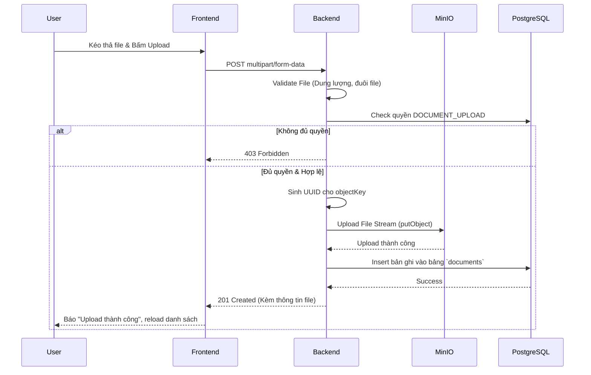
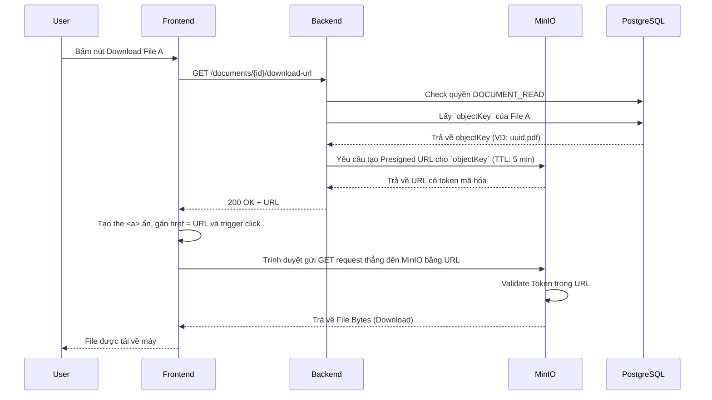

# Detailed Specification - Phase 3: Knowledge Base (Documents)

## 1. Tổng quan & Quy tắc nghiệp vụ (Business Rules)
Module này quản lý việc lưu trữ và truy xuất tài liệu vật lý thông qua Object Storage (MinIO) và quản lý siêu dữ liệu (Metadata) qua PostgreSQL.
- **Bảo mật File**: File vật lý upload lên MinIO được đặt trong một Bucket (VD: `knowledge-base`) ở chế độ **Private**. Người ngoài không thể truy cập trực tiếp bằng URL của MinIO.
- **Tải File (Download)**: Khi User muốn xem/tải file, Backend sẽ dùng MinIO SDK để tạo ra một **Presigned URL** (đường dẫn dùng một lần, có thời hạn 5 phút). Trình duyệt sẽ dùng link này để tải file trực tiếp từ MinIO, giúp giảm tải băng thông cho Backend.
- **Quyền hạn (RBAC)**:
  - Để Upload: Cần permission `DOCUMENT_UPLOAD` trong Project.
  - Để Xem/Tải: Cần permission `DOCUMENT_READ`.
  - Để Xóa: Cần permission `DOCUMENT_DELETE`. (Lưu ý: User tự tải file lên thì có quyền xóa file của chính mình dù không có quyền Delete chung).
- **Validation File**:
  - Kích thước: Max 100MB mỗi file.
  - Định dạng cho phép: PDF, DOCX, XLSX, PPTX, TXT, MD, Hình ảnh (JPG, PNG), Video (MP4). Đuôi file khác -> 400 Bad Request.
  - Chống trùng lặp tên vật lý: Lưu vào DB bằng Tên gốc (`original_name`), nhưng lưu vào MinIO bằng một Tên sinh tự động `UUID.ext` (`object_key`).

## 2. Thiết kế Cơ sở dữ liệu (Database Schema)

Bảng **`documents`**
| Column Name | Data Type | Constraints | Description |
| :--- | :--- | :--- | :--- |
| `id` | UUID | Primary Key | |
| `project_id` | UUID | FK -> projects | Nằm trong dự án nào |
| `original_name`| VARCHAR(255) | NOT NULL | Tên file gốc (VD: `bao-cao.pdf`) |
| `file_type` | VARCHAR(100) | NOT NULL | MIME Type (VD: `application/pdf`) |
| `file_size_bytes`| BIGINT | NOT NULL | Kích thước file (byte) |
| `object_key` | VARCHAR(255) | UNIQUE, NOT NULL | Tên vật lý trên MinIO (VD: `proj_abc/uuid.pdf`) |
| `uploaded_by` | UUID | FK -> users | Người tải lên (JPA Auditing) |
| `created_at` | TIMESTAMP | NOT NULL | Ngày tải (JPA Auditing) |
| `is_deleted` | BOOLEAN | DEFAULT FALSE | Xóa mềm |

## 3. Đặc tả API (API Contracts)

### 3.1. Upload Tài liệu
- **Method & Path**: `POST /api/v1/projects/{projectId}/documents`
- **Security Check**: Cần `DOCUMENT_UPLOAD`.
- **Request Type**: `multipart/form-data`
  - `file`: File nhị phân.
- **Response (201 Created)**:
```json
{
  "success": true,
  "message": "Upload tài liệu thành công",
  "data": {
    "id": "doc-uuid...",
    "originalName": "bao-cao.pdf",
    "fileSize": 1048576,
    "createdAt": "..."
  }
}
```
- **Errors**: `413 PAYLOAD_TOO_LARGE` (quá 100MB), `415 UNSUPPORTED_MEDIA_TYPE` (file cấm).

### 3.2. Lấy danh sách Tài liệu
- **Method & Path**: `GET /api/v1/projects/{projectId}/documents`
- **Security Check**: Cần `DOCUMENT_READ`.
- **Query Params**: `page`, `size`
- **Response (200 OK)**:
```json
{
  "success": true,
  "data": [
    {
      "id": "...",
      "originalName": "bao-cao.pdf",
      "fileType": "application/pdf",
      "fileSize": 1048576,
      "uploadedBy": { "id": "...", "fullName": "Bảo" },
      "createdAt": "..."
    }
  ],
  "meta": { "totalElements": 20 }
}
```

### 3.3. Sinh Presigned URL để Tải/Xem file
- **Method & Path**: `GET /api/v1/projects/{projectId}/documents/{docId}/download-url`
- **Security Check**: Cần `DOCUMENT_READ`.
- **Response (200 OK)**:
```json
{
  "success": true,
  "data": {
    "url": "http://localhost:9000/knowledge-base/proj_abc/uuid.pdf?X-Amz-Algorithm=...",
    "expiresInSeconds": 300
  }
}
```

### 3.4. Xóa Tài liệu
- **Method & Path**: `DELETE /api/v1/projects/{projectId}/documents/{docId}`
- **Security Check**: Cần `DOCUMENT_DELETE` HOẶC `uploaded_by == current_user_id`.
- **Logic**: Chỉ update `is_deleted = true`. File vật lý trên MinIO không bị xóa ngay (có thể làm Cronjob dọn dẹp sau).

## 4. Sequence Diagram (Sơ đồ luồng)

### 4.1 Luồng Upload File


### 4.2 Luồng Tải/Xem File (Presigned URL)


## User Review Required
> [!IMPORTANT]
> Đây là bản đặc tả **Hoàn chỉnh và Đầy đủ (Detailed Spec)** cho Phase 3 (Documents).
> 
> Bản spec này làm rõ:
> - Cách thức hoạt động của Presigned URL để bảo mật file vật lý trên MinIO.
> - API Multipart Form-data để Upload.
> - Luồng chặn quyền và validation kích thước file.
> 
> Vui lòng bấm **Proceed** nếu bạn đồng ý với cấu trúc chi tiết này để tôi ghi đè vào file `doc/phases/Phase_3_Document.md`!
