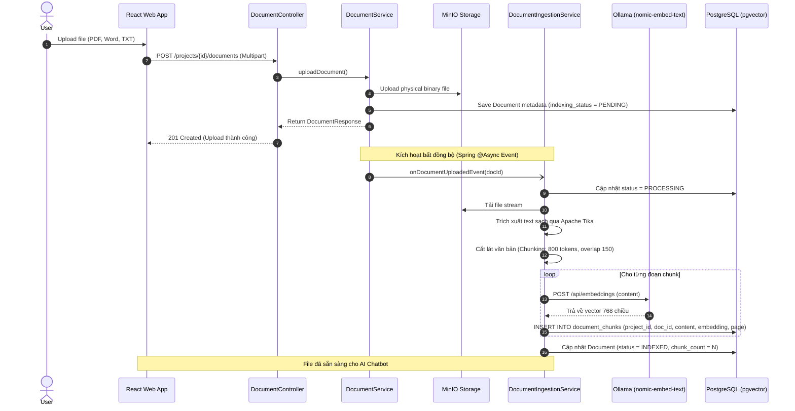
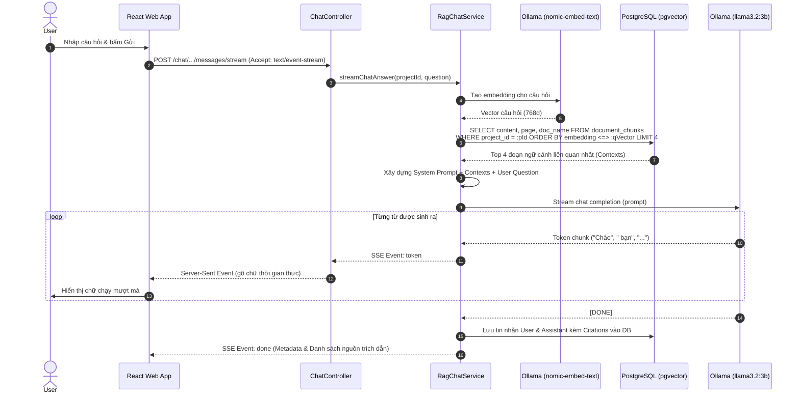

# Detailed Specification - Phase 5: AI Chatbot Hỏi Đáp Tài Liệu (RAG Knowledge Base)

> **Trạng thái**: ĐÃ HOÀN THÀNH VÀ KIỂM THỬ E2E (100% PASS)  
> **Kiến trúc**: Spring Boot 3.4 + Ollama Local (`nomic-embed-text` + `llama3.2:3b`) + PostgreSQL `pgvector 0.8.6` + React TypeScript Apple Glassmorphism  
> **Cơ chế**: Server-Sent Events (SSE) streaming theo thời gian thực, RBAC Project Isolation, Source Citations  

## 1. Tổng Quan & Quy Tắc Nghiệp Vụ (Business Rules)

Module **AI Chatbot RAG (Retrieval-Augmented Generation)** cung cấp khả năng hỏi đáp thông minh dựa trên toàn bộ kho tài liệu nội bộ của từng dự án. Hệ thống kết hợp cơ sở dữ liệu vector (**PostgreSQL pgvector**) và mô hình AI cục bộ (**Ollama Local: `nomic-embed-text` + `llama3.2:3b`**) nhằm đảm bảo tính bảo mật 100% On-Premise, hiệu năng cao và hoàn toàn miễn phí.

### 1.1 Nguyên tắc Bảo Mật Cấp Dự Án (RBAC Isolation)
- **Cách ly tuyệt đối theo Dự án (`project_id`)**: Mọi truy vấn vector và ngữ cảnh tìm kiếm được giới hạn nghiêm ngặt trong phạm vi của `project_id` hiện tại. AI không bao giờ được phép "nhìn thấy" hoặc trích dẫn tài liệu từ các dự án khác.
- **Quyền hạn truy cập**:
  - Người dùng phải là thành viên dự án và có quyền `DOC_READ` (hoặc `PROJECT_READ`) để tham gia hỏi đáp AI.
  - Người dùng có quyền `DOC_CREATE` hoặc `PROJECT_UPDATE` mới có quyền kích hoạt tính năng Đánh chỉ mục lại (Re-index) tài liệu.

### 1.2 Chiến lược Xử lý & Cắt Lát Tài Liệu (Document Ingestion & Chunking)
- **Định dạng hỗ trợ trích xuất**: PDF (`.pdf`), Microsoft Word (`.docx`), Văn bản thuần (`.txt`), Markdown (`.md`).
- **Trích xuất nội dung (Text Extraction)**: Sử dụng thư viện chuyên dụng (Apache Tika / PDFBox) đọc Stream từ MinIO để trích xuất văn bản sạch và số trang vật lý.
- **Cắt lát ngữ cảnh (Chunking Strategy)**:
  - Kích thước đoạn (Chunk Size): ~800 tokens (~2.500 - 3.200 ký tự).
  - Độ gối đầu (Chunk Overlap): ~150 tokens (~500 ký tự) nhằm bảo toàn tính liền mạch ngữ nghĩa giữa các đoạn cắt.
- **Lưu trữ Vector**: Mỗi đoạn văn bản (chunk) được vector hóa thành vector 768 chiều bởi model `nomic-embed-text` và lưu vào PostgreSQL pgvector.

### 1.3 Cơ chế Sinh Câu Trả Lời & Trích Dẫn Nguồn (Generation & Citations)
- **Tìm kiếm tương đồng (Similarity Search)**: Sử dụng khoảng cách Cosine (`vector_cosine_ops`) để tìm Top K (3 - 5 đoạn văn bản) có độ tương đồng ngữ nghĩa cao nhất với câu hỏi của người dùng.
- **Nguyên tắc chống ảo giác (Hallucination Guardrails)**:
  - Prompt hệ thống yêu cầu AI: *"Chỉ trả lời dựa trên ngữ cảnh tài liệu được cung cấp. Nếu ngữ cảnh không có thông tin, hãy thành thật trả lời là tài liệu không đề cập, không được tự bịa đặt câu trả lời."*
- **Trích dẫn nguồn minh bạch (Source Citations)**: Mỗi câu trả lời của AI phải đính kèm danh sách nguồn tài liệu tham khảo cụ thể (Tên file, số trang, trích đoạn ngắn liên quan) để người dùng dễ dàng kiểm chứng.
- **Phản hồi thời gian thực (Streaming Response)**: Sử dụng kỹ thuật Server-Sent Events (SSE) để stream từng từ (token) của LLM về giao diện React, mang lại trải nghiệm tương tác trực quan như ChatGPT.

---

## 2. Thiết Kế Cơ Sở Dữ Liệu (Database Schema)

### 2.1 Kích hoạt Extension Vector
```sql
CREATE EXTENSION IF NOT EXISTS vector;
```

### 2.2 Cập nhật Bảng `documents`
Bổ sung trường theo dõi trạng thái embedding của file:
| Column Name | Data Type | Constraints | Description |
| :--- | :--- | :--- | :--- |
| `indexing_status` | VARCHAR(20) | NOT NULL DEFAULT 'PENDING' | Trạng thái: `PENDING`, `PROCESSING`, `INDEXED`, `FAILED` |
| `chunk_count` | INTEGER | NOT NULL DEFAULT 0 | Tổng số chunks văn bản đã bóc tách |
| `indexed_at` | TIMESTAMP | NULL | Thời điểm hoàn tất đánh chỉ mục |

### 2.3 Bảng `document_chunks` (Vector Store)
Lưu trữ các đoạn văn bản đã cắt lát và vector embedding tương ứng:
| Column Name | Data Type | Constraints | Description |
| :--- | :--- | :--- | :--- |
| `id` | UUID | Primary Key | Định danh chunk |
| `project_id` | UUID | FK -> `projects.id`, NOT NULL | Khóa ngoại phân vùng dự án |
| `document_id` | UUID | FK -> `documents.id`, NOT NULL | Khóa ngoại tài liệu gốc |
| `chunk_index` | INTEGER | NOT NULL | Thứ tự chunk trong tài liệu (0, 1, 2...) |
| `content` | TEXT | NOT NULL | Nội dung đoạn văn bản gốc |
| `page_number` | INTEGER | NULL | Số trang tương ứng trong file PDF/Word |
| `embedding` | VECTOR(768) | NOT NULL | Vector nhúng sinh bởi `nomic-embed-text` |
| `created_at` | TIMESTAMP | NOT NULL DEFAULT NOW() | Thời gian tạo |

**Chỉ mục tối ưu tìm kiếm HNSW:**
```sql
CREATE INDEX idx_document_chunks_embedding 
ON document_chunks USING hnsw (embedding vector_cosine_ops);

CREATE INDEX idx_document_chunks_project_id 
ON document_chunks (project_id);
```

### 2.4 Bảng `chat_conversations` (Phiên Hội Thoại)
| Column Name | Data Type | Constraints | Description |
| :--- | :--- | :--- | :--- |
| `id` | UUID | Primary Key | Mã phiên chat |
| `project_id` | UUID | FK -> `projects.id`, NOT NULL | Thuộc dự án nào |
| `user_id` | UUID | FK -> `users.id`, NOT NULL | Người tạo phiên chat |
| `title` | VARCHAR(255) | NOT NULL | Tiêu đề cuộc trò chuyện (auto-generated) |
| `created_at` | TIMESTAMP | NOT NULL | Ngày tạo |
| `updated_at` | TIMESTAMP | NOT NULL | Lần cập nhật cuối |

### 2.5 Bảng `chat_messages` (Tin Nhắn Trong Phiên)
| Column Name | Data Type | Constraints | Description |
| :--- | :--- | :--- | :--- |
| `id` | UUID | Primary Key | Mã tin nhắn |
| `conversation_id` | UUID | FK -> `chat_conversations.id`, NOT NULL | Thuộc cuộc trò chuyện nào |
| `sender_type` | VARCHAR(20) | NOT NULL | `USER` hoặc `ASSISTANT` |
| `content` | TEXT | NOT NULL | Nội dung câu hỏi hoặc câu trả lời |
| `citations` | JSONB | NULL | Mảng JSON các nguồn trích dẫn tài liệu |
| `created_at` | TIMESTAMP | NOT NULL | Thời gian gửi tin |

---

## 3. Đặc Tả API (API Contracts)

### 3.1. Quản lý Cuộc Trò Chuyện (Conversations)

#### A. Lấy danh sách cuộc trò chuyện của User trong dự án
- **Method & Path**: `GET /api/v1/projects/{projectId}/chat/conversations`
- **Security Check**: Cần `DOC_READ` và là thành viên dự án.
- **Response (200 OK)**:
```json
{
  "success": true,
  "message": "Lấy danh sách hội thoại thành công",
  "data": [
    {
      "id": "conv-uuid-1",
      "title": "Kế hoạch tài chính quý 3",
      "createdAt": "2026-09-17T09:00:00Z",
      "updatedAt": "2026-09-17T09:15:00Z"
    }
  ]
}
```

#### B. Tạo cuộc trò chuyện mới
- **Method & Path**: `POST /api/v1/projects/{projectId}/chat/conversations`
- **Request Body**:
```json
{
  "title": "Hỏi đáp tài liệu dự án"
}
```
- **Response (201 Created)**: Trả về chi tiết conversation vừa tạo.

#### C. Lấy lịch sử tin nhắn trong cuộc trò chuyện
- **Method & Path**: `GET /api/v1/projects/{projectId}/chat/conversations/{conversationId}/messages`
- **Response (200 OK)**:
```json
{
  "success": true,
  "data": [
    {
      "id": "msg-1",
      "senderType": "USER",
      "content": "Tổng ngân sách dự kiến là bao nhiêu?",
      "createdAt": "2026-09-17T09:01:00Z"
    },
    {
      "id": "msg-2",
      "senderType": "ASSISTANT",
      "content": "Theo kế hoạch tài chính, tổng ngân sách dự kiến là 5 tỷ VNĐ...",
      "citations": [
        {
          "documentId": "doc-uuid-1",
          "documentName": "Bao_cao_tai_chinh.pdf",
          "pageNumber": 12,
          "snippet": "Mục 3.1: Tổng dự toán ngân sách quý 3 là 5.000.000.000 VNĐ..."
        }
      ],
      "createdAt": "2026-09-17T09:01:05Z"
    }
  ]
}
```

### 3.2. Hỏi Đáp Thời Gian Thực (Streaming Chat API)

- **Method & Path**: `POST /api/v1/projects/{projectId}/chat/conversations/{conversationId}/messages/stream`
- **Security Check**: `@projectSecurity.hasPermission(#projectId, 'DOC_READ')`
- **Headers**:
  - `Accept: text/event-stream`
- **Request Body**:
```json
{
  "question": "Hệ thống hỗ trợ những định dạng file nào?"
}
```
- **Response Stream (SSE - Server Sent Events)**:
```http
HTTP/1.1 200 OK
Content-Type: text/event-stream;charset=UTF-8
Cache-Control: no-cache
Connection: keep-alive

event: token
data: {"token": "Hệ"}

event: token
data: {"token": " thống"}

event: token
data: {"token": " hỗ"}

event: token
data: {"token": " trợ..."}

event: done
data: {
  "messageId": "msg-uuid-generated",
  "fullContent": "Hệ thống hỗ trợ các định dạng PDF, DOCX, XLSX, TXT...",
  "citations": [
    {
      "documentId": "doc-uuid-10",
      "documentName": "Huong_dan_su_dung.md",
      "pageNumber": 1,
      "snippet": "Các định dạng cho phép: PDF, DOCX, TXT..."
    }
  ]
}
```

### 3.3. Đánh Chỉ Mục Thủ Công (Re-index Document)
- **Method & Path**: `POST /api/v1/projects/{projectId}/documents/{docId}/index`
- **Security Check**: `@projectSecurity.hasPermission(#projectId, 'DOC_CREATE')`
- **Description**: Buộc hệ thống bóc tách lại file từ MinIO và tính toán lại vector embedding.

---

## 4. Sơ Đồ Luồng (Sequence Diagrams)

### 4.1 Luồng Tự Động Xử Lý & Vector Hóa Tài Liệu (Background Ingestion)


---

### 4.2 Luồng Hỏi Đáp RAG & Streaming Kết Quả (Retrieval & Generation)


---

## 5. Cấu Trúc Giao Diện Người Dùng (React Frontend - Apple Aesthetic)

### 5.1 Vị Trí Trợ Lý AI
- Trên thanh điều hướng Tab của trang [ProjectDetail.tsx](file:///Users/tqbao4205/Documents/Project/web/src/pages/ProjectDetail.tsx), bổ sung Tab thứ 3: **"Trợ lý AI"** (Sparkles Icon ✨).
- Hoặc một nút nổi tròn **"Ask AI"** ở góc phải màn hình, khi bấm sẽ trượt ra một **Slide-over Drawer** kính mờ chuẩn phong cách macOS / iPadOS.

### 5.2 Thành Phần Giao Diện Chat
1. **Sidebar Lịch Sử Trò Chuyện (Conversation List)**:
   - Nút `+ Cuộc trò chuyện mới` phong cách Apple Squircle.
   - Danh sách các phiên chat trước đó, hỗ trợ đổi tên hoặc xóa.
2. **Khung Hội Thoại Chính (Chat Area)**:
   - Bong bóng tin nhắn người dùng: Màu xanh dương Apple Gradient (`#0071e3`), chữ trắng bo cong mềm mại.
   - Bong bóng AI: Màu nền xám kính mờ nhạt (`bg-black/5 dark:bg-white/10`), hỗ trợ render Markdown đậm nét, bảng biểu và khối code có syntax highlight.
   - **Thẻ Trích Dẫn Nguồn (Citation Pill Badges)**:
     - Hiển thị dưới câu trả lời của AI: `📄 Ke_hoach_kinh_doanh.pdf (Trang 4)`.
     - Khi người dùng rê chuột hoặc bấm vào, hiển thị popup xem nhanh đoạn văn bản trích dẫn gốc.
3. **Thanh Nhập Liệu (Prompt Input Bar)**:
   - Ô nhập bo cong lớn (Pill input), hỗ trợ tự động giãn nở chiều cao (auto-expand textarea), kèm nút gửi mũi tên hướng lên đặc trưng của Apple Intelligence.
   - Gợi ý câu hỏi nhanh (Prompt Suggestions): *"Tóm tắt các tài liệu trong dự án"*, *"Rủi ro chính được đề cập là gì?"*.

---

## 6. Tiêu Chuẩn Kiểm Thử & Nghiệm Thu (Acceptance Criteria)

1. **Khả năng Cách ly Dữ liệu (Security & Isolation)**:
   - Tạo 2 dự án `A` và `B`. Upload tài liệu bí mật vào `A`.
   - Vào dự án `B` hỏi AI về thông tin trong tài liệu của `A` ➔ AI phải trả lời dứt khoát: *"Không tìm thấy thông tin này trong tài liệu của dự án."*
2. **Hiệu Năng Phản Hồi**:
   - Thời gian tìm kiếm vector tương đồng trên PostgreSQL < 50ms.
   - Thời gian bắt đầu nhận token đầu tiên từ Ollama (Time to First Token) < 1.5 giây trên Apple M2.
   - Tốc độ sinh chữ streaming đạt trên 40 tokens/giây.
3. **Độ Ổn Định Khi Upload Tài Liệu Lớn**:
   - Upload file PDF 50 trang: Hệ thống bóc tách ngầm ở background, không làm đơ request upload, hiển thị trạng thái `Đang xử lý` -> `Sẵn sàng`.
4. **Kiểm Thử Tự Động (JUnit Test Suite)**:
   - Đạt 100% tests pass cho toàn bộ controller và service liên quan đến Chat & Ingestion.
